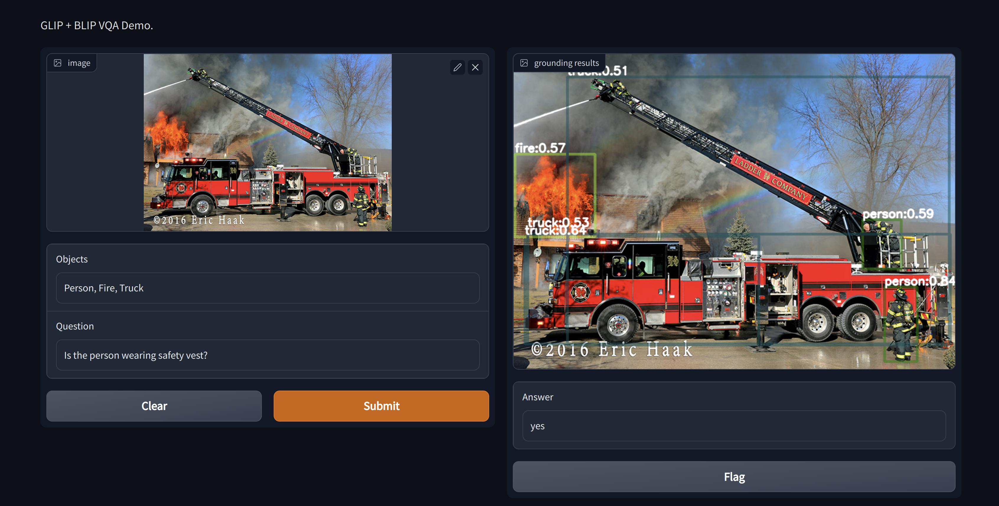

# Vision-Language Object Detection and Visual Question Answering
This repository includes Microsoft's GLIP and Salesforce's BLIP ensembled demo for detecting objects and Visual Question Answering based on text prompts.  
<br />


## Updates 
Integrated into [Huggingface Spaces 🤗](https://huggingface.co/spaces/Pinwheel/GLIP-BLIP-Object-Detection-VQA)

<p align="left">
    <a href="#">
        
    </a>
</p>

<br />

## About GLIP: Grounded Language-Image Pre-training - 
> GLIP demonstrate strong zero-shot and few-shot transferability to various object-level recognition tasks.

> The model used in this repo is GLIP-T, it is originally pre-trained on Conceptual Captions 3M and SBU captions.

<br />

## About BLIP: Bootstrapping Language-Image Pre-training for Unified Vision-Language Understanding and Generation - 

> A new model architecture that enables a wider range of downstream tasks than existing methods, and a new dataset bootstrapping method for learning from noisy web data.


<br />

## Installation and Setup

***Enviornment*** - Due to limitations with `maskrcnn_benchmark`, this repo requires Pytorch=1.10 and torchvision.

Use `requirements.txt` to install dependencies

```sh
pip3 install -r requirements.txt
```
Build `maskrcnn_benchmark`
```
python setup.py build develop --user
```

To verify a successful build, check the terminal for message  
"Finished processing dependencies for maskrcnn-benchmark==0.1"

## Checkpoints

> Download the pre-trained models into the `checkpoints` folder.

<br />

```sh
mkdir checkpoints
cd checkpoints
```

Model | Weight
-- | --
**GLIP-T** | [weight](https://drive.google.com/file/d/1nlPL6PHkslarP6RiWJJu6QGKjqHG4tkc/view?usp=sharing)
**BLIP** | [weight](https://drive.google.com/file/d/1QliNGiAcyCCJLd22eNOxWvMUDzb7GzrO/view?usp=sharing)

<br />files.maxMemoryForLargeFilesMB

## If you have an NVIDIA GPU with 8GB VRAM, run local demo using Gradio interface

```sh
python3 app_local.py
```

## Sample display
</br>

> After loading the checkpoints, you must click on the prompted local URL to run inference. 

Video I/O
[]()

Image I/O
[]()

## Future Work

- [x] Frame based Visual Question Answering
- [x] Video based Visual Question Answering
- [ ] Each object based Visual Question Answering


## Citations

```txt
@inproceedings{li2022blip,
      title={BLIP: Bootstrapping Language-Image Pre-training for Unified Vision-Language Understanding and Generation}, 
      author={Junnan Li and Dongxu Li and Caiming Xiong and Steven Hoi},
      year={2022},
      booktitle={ICML},
}
@inproceedings{li2021grounded,
      title={Grounded Language-Image Pre-training},
      author={Liunian Harold Li* and Pengchuan Zhang* and Haotian Zhang* and Jianwei Yang and Chunyuan Li and Yiwu Zhong and Lijuan Wang and Lu Yuan and Lei Zhang and Jenq-Neng Hwang and Kai-Wei Chang and Jianfeng Gao},
      year={2022},
      booktitle={CVPR},
}
@article{zhang2022glipv2,
  title={GLIPv2: Unifying Localization and Vision-Language Understanding},
  author={Zhang, Haotian* and Zhang, Pengchuan* and Hu, Xiaowei and Chen, Yen-Chun and Li, Liunian Harold and Dai, Xiyang and Wang, Lijuan and Yuan, Lu and Hwang, Jenq-Neng and Gao, Jianfeng},
  journal={arXiv preprint arXiv:2206.05836},
  year={2022}
}
@article{li2022elevater,
  title={ELEVATER: A Benchmark and Toolkit for Evaluating Language-Augmented Visual Models},
  author={Li*, Chunyuan and Liu*, Haotian and Li, Liunian Harold and Zhang, Pengchuan and Aneja, Jyoti and Yang, Jianwei and Jin, Ping and Lee, Yong Jae and Hu, Houdong and Liu, Zicheng and others},
  journal={arXiv preprint arXiv:2204.08790},
  year={2022}
}
```
## Acknowledgement
The implementation of this work relies on resources from <a href="https://github.com/salesforce/BLIP">BLIP</a>, <a href="https://github.com/microsoft/GLIP">GLIP</a>,  <a href="https://github.com/huggingface/transformers">Huggingface Transformers</a>, and <a href="https://github.com/rwightman/pytorch-image-models/tree/master/timm">timm</a>. We thank the original authors for their open-sourcing.
